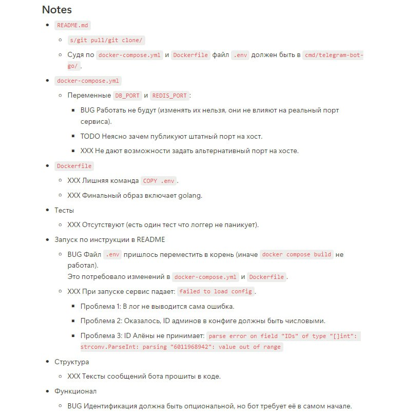
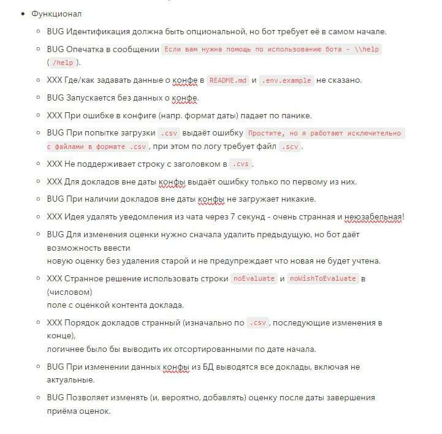

- [Used libraries](#used-libraries)
- [Project Structure](#project-structure)
- [.env Small Explanations](#env-small-explanations)
- [Getting Started](#getting-started)
- [Project Features](#project-features)
- [Need to Add](#need-to-add)

## Used libraries
- [gotgbot](https://github.com/PaulSonOfLars/gotgbot)
- [godotenv](https://github.com/joho/godotenv)
- [env](https://github.com/caarlos0/env)
- [mongo-go-driver](https://github.com/mongodb/mongo-go-driver)
- [go-redis](https://github.com/redis/go-redis)

## Project Structure
- **cmd/**: Contains the entry point of the application.
    - **telegram-bot-go/**: Houses the main application executable.
        - **main.go**: Main application file.

- **internal/**: Core application code that is not intended to be exported.
    - **bot/**: Telegram bot handlers, routers, and keyboards.
        - **fsm/**: Simple finite state machine.
        - **handlers/**: Handlers for the bot.
        - **notificator/**: Notification scheduling and handling.
    - **config/**: Configuration files.
        - **config.go**: Main configuration file.
    - **logger/**: Logging.
        - **logger.go**: Main logging file.
    - **models/**: Data models.
        - **models.go**: Main data models.
    - **repository/**: Data access implementations.
        - **mongodb/**: MongoDB repository implementations.
        - **redis/**: Redis cache implementations.
- **go.mod** and **go.sum**: Go module files for managing dependencies.

## .env Small Explanations

#### .env file should be in root directory

ADMIN_IDS_LIST - list of administrator IDs, which contains integers, separated by `,` (for singular admin you need to pass `ADMIN_IDS_LIST=121123`). Use https://t.me/getmyid_bot to ger your id

All others explanations can be found in `.env.example`

## Getting Started
This is a stateful telegram bot for _GolangConf 2024_. I tried to implement a VERY simple FSM using redis. It means, that bot has only 2 commands - /start and /help, and you can easily restart this bot and all user's data will be saved. There are 2 user groups: admins and regular users. So as admin you can upload schedule and download user reviews in JSON format, also this role includes default user abilities. As usual user you can see the list of upcoming reports (if admins downloaded them), choose your favorite report, make a report evaluation (available if report started), delete and change your own evaluations and change your identification (forgot to say about it in the start). For sure this bot controls most of the users actions for better user experience. Here also realised the simple notification system: 
- Notification 10 minutes before the start of the report
- After completing the report: request a report evaluation if it has not already been set
- At the end of the day (1 hour after the completion of the last report): request a grade for all reports of this day for which it is not given.
- 2 days after the end of the conference: request a rating for all conference reports for which it is not given.

All notifications will be automatically deleted after 7 seconds of living. JSON file will be deleted after 1 min of living.
*asked to remove them*

#### Few easy steps to start a project :
1. `git pull https://github.com/NOSTRADA88/telegram-bot-go`
2. `Create and set up your own ".env" file (in the content root, pulled directory). In project, you can find an ".env.example", make sure that you are using THE SAME VARIABLES= as they named in the example file. Else you will have bot running issues`
3. `docker-compose build`
4. `docker-compose up -d`

## Project Features

- **FSM**: A finite state machine to manage user states.
- **Handlers**: Functions to handle different types of user interactions.
- **Notifications**: Scheduled notifications to remind users about events and actions.
- **MongoDB**: Data storage and retrieval.
- **Redis**: Cache implementation for fast access to frequently used data.

## Need to Add

1. Changes from reviewer.
2. Tests (honestly they were, but all of them were useless, so I need to rewrite them all).
3. Metrics (grafana).

#### required changes:

